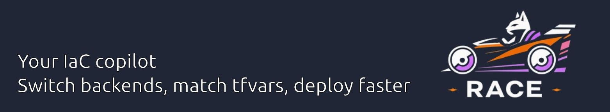

# Race - Remote AWS Code Control Executor - Terraform Tools for CatStack

**Tools for CatStack** (https://github.com/wearetechnative/catstack)




RACE (Remote AWS Code Control Executor) is a collection of Infrastructure as Code (IaC) utilities that make life easier for Cloud Engineers. RACE is designed to work with [CatStack](https://github.com/wearetechnative/catstack) and provides an integrated CLI for managing backends, variables, and Nix workflows. Currently focused on Terraform, with future support planned for OpenTofu and other IaC tools.

**Version:** 0.1.5

## Features

- **Backend Management**: Easily switch between multiple IaC backends (Terraform/OpenTofu)
- **Automatic tfvars selection**: Automatically matches the correct `.tfvars` files to your backend
- **Nix Integration**: Intelligent matching of backends with Nix flake targets
- **Safety Protection**: Prevents accidental destruction of critical resources (backend, DynamoDB, KMS)
- **Interactive CLI**: User-friendly menus for backend selection
- **Multi-environment support**: Work seamlessly with nonprod, prod, and other environments
- **Extensible**: Designed with future support for OpenTofu and other IaC tools in mind
- **Git Sync**: Automatically commit, tag, and push after successful applies to keep git in sync with cloud state

## Installation

### Via Nix Flakes

```bash
nix profile install github:wearetechnative/race
```

### Manual installation

1. Clone the repository:
```bash
git clone https://github.com/wearetechnative/race.git
cd race
```

2. Make the scripts executable and add to your PATH:
```bash
chmod +x race
sudo ln -s $(pwd)/race /usr/local/bin/race
```

## Usage

RACE provides a unified command-line interface for all IaC utilities:

```bash
race [command]
```

### Available commands

- `race usage` - Show help information
- `race version` - Show race version
- `race init` - Configure backend (currently Terraform, OpenTofu support planned)
- `race plan` - Run plan command with automatic tfvars selection
- `race apply` - Run apply command with automatic tfvars selection
- `race nixrun` - Run nix run for the selected backend
- `race elastinixkey` - Generate SSH keypair

### Workflow

#### 1. Configure backend

```bash
race init
```

This script searches for all `*.tfbackend` files in your project and lets you interactively choose a backend. The selection is saved in `.terraform/tfbackend.state`.

#### 2. Plan/Apply

```bash
race plan
race apply
```

These commands:
- Read the active backend from `.terraform/tfbackend.state`
- Automatically match the corresponding `.tfvars` file (e.g., `nonprod.tfbackend` → `nonprod.tfvars`)
- Execute the IaC tool (currently Terraform) with the correct variables

#### 3. Nix integration

For projects using Nix flakes:

```bash
race nixrun
```

This script:
- Reads the active backend from `.terraform/tfbackend.state`
- Searches for matching targets in `flake.nix`
- Executes `nix run .#<target>` for the correct environment

## Project Structure

RACE expects a specific project structure that works with CatStack:

```
project/
├── *.tfbackend          # Backend configurations (nonprod.tfbackend, prod.tfbackend)
├── *.tfvars             # Variable files (nonprod.tfvars, prod.tfvars)
├── flake.nix            # (Optional) Nix flake for declarative workflows
├── stack/               # IaC stack directories (Terraform/OpenTofu)
│   └── domain/          # Domain-specific IaC code
└── .terraform/
    └── tfbackend.state  # Current active backend (managed by race)
```

## Examples

### Example 1: Switching between environments

```bash
# Configure nonprod backend
race init
# Select: 0: nonprod.tfbackend

# Plan changes for nonprod
race plan

# Switch to prod
race init
# Select: 1: prod.tfbackend

# Plan changes for prod
race plan -out prod.tfplan
```

### Example 2: Nix workflow

```bash
# Configure backend
race init
# Select: nonprod

# Run nix run (automatically matches nonprod_apply in flake.nix)
race nixrun
```

## Requirements

- Bash 4.0+
- Terraform (or OpenTofu - planned support)
- AWS CLI (with configured `AWS_PROFILE`)
- (Optional) Nix with flakes support
- (Optional) gum - for better interactive prompts

## Git Sync (Auto-commit after Apply)

RACE can automatically commit, tag, and push your changes after a successful `terraform apply` or `nix run` apply operation. This ensures your git repository stays in sync with your deployed cloud state.

### How it works

1. **Pre-apply check**: Before running apply, RACE checks for untracked files. If found, the apply is blocked to ensure all changes are committed.
2. **Post-apply sync**: After a successful apply, RACE automatically:
   - Commits any staged changes with message: `RACE: apply {environment} {domain}`
   - Creates a tag: `{environment}_{domain}_{YYYYMMDD-HHhMMm}` (e.g., `nonprod_01_shared_kms_20260211-14h30m`)
   - Pushes the commit and tag to the remote

### Configuration

Git sync is **enabled by default**. Configure with environment variables:

| Variable | Default | Description |
|----------|---------|-------------|
| `RACE_GIT_SYNC_ENABLED` | `true` | Set to `false` to disable git sync |
| `RACE_GIT_REMOTE` | `origin` | Git remote to push to |
| `RACE_STACK_DOMAIN` | auto-detected | Override the stack domain name in tags |

### Examples

```bash
# Disable git sync for this apply
RACE_GIT_SYNC_ENABLED=false race apply

# Use a different git remote
RACE_GIT_REMOTE=upstream race apply

# Override the domain name in tags
RACE_STACK_DOMAIN=custom_domain race apply
```

## Safety Measures

RACE includes built-in safety measures:

1. **Git status check**: Before apply operations, RACE checks for untracked files and blocks the operation if found
2. **Nix projects**: When `.nix` files are detected, race asks for confirmation before executing IaC commands
3. **Destroy protection**: The `tfdestroy` script prevents destruction of resources with names:
   - backend
   - dynamodb
   - kms

## Documentation

For detailed documentation on individual components:

- [Backend Switcher and Tools](./docs/terraform-backend-tools.md)
- [Setup TF Plugin Cache](./docs/setup_tf_plugin_cache.md)

## Future Roadmap

- **OpenTofu Support**: Native support for OpenTofu as an alternative to Terraform
- **Additional IaC Tools**: Expand support to other Infrastructure as Code tools
- **Enhanced Nix Integration**: Extended Nix flake patterns and workflows

## Development

RACE is built with:
- Bash for the core scripts
- Python for documentation generation
- Nix for reproducible builds and distribution

### Testing

RACE uses [ShellSpec](https://github.com/shellspec/shellspec) for unit testing.

```bash
# Enter the development shell (includes shellspec)
nix develop

# Run all tests
shellspec

# Run tests with verbose output
shellspec --format documentation

# Run specific spec file
shellspec spec/racelib_spec.sh

# Run tests in parallel
shellspec --jobs 4
```

Test files are located in `spec/`:
- `spec/racelib_spec.sh` - Tests for core library functions
- `spec/git_sync_spec.sh` - Tests for git sync functionality

### Changelog

See [CHANGELOG.md](./CHANGELOG.md) for a complete overview of changes.

## License

RACE is available under the MIT license. See [LICENSE](./LICENSE) for more information.

## Authors

Developed by Wouter, Pim, et al. at [Technative](https://technative.nl)

© Technative 2024

## Links

- [GitHub Repository](https://github.com/wearetechnative/race)
- [CatStack](https://github.com/wearetechnative/catstack)
- [Technative](https://technative.eu)
